# Catálogo de Iconos & Recursos Visuales — Artefact

Catálogo completo de todos los activos gráficos extraídos directamente de la plantilla oficial de Artefact (Noviembre 2024).

---

## 1. Logotipos Oficiales (`assets/logos/`)

Los logotipos se encuentran en máxima resolución PNG con transparencia alfa.

| Archivo | Vista Previa | Descripción & Uso |
| :--- | :---: | :--- |
| `artefact_logo_primary_dark.png` | 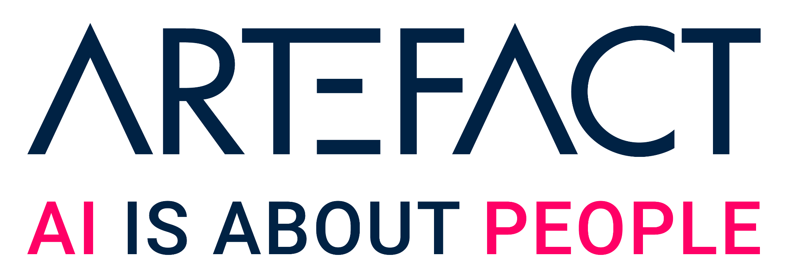 | Logotipo principal oscuro con isotipo A y wordmark. Usar en fondos blancos/claros. |
| `artefact_logo_primary_white.png` |  | Logotipo principal blanco/invertido. Usar en fondos azul marino y degradados. |
| `artefact_logo_horizontal_dark.png` |  | Wordmark horizontal azul oscuro sin isotipo. |
| `artefact_logo_horizontal_white.png` |  | Wordmark horizontal blanco sin isotipo. |
| `artefact_monogram_a_dark.png` | 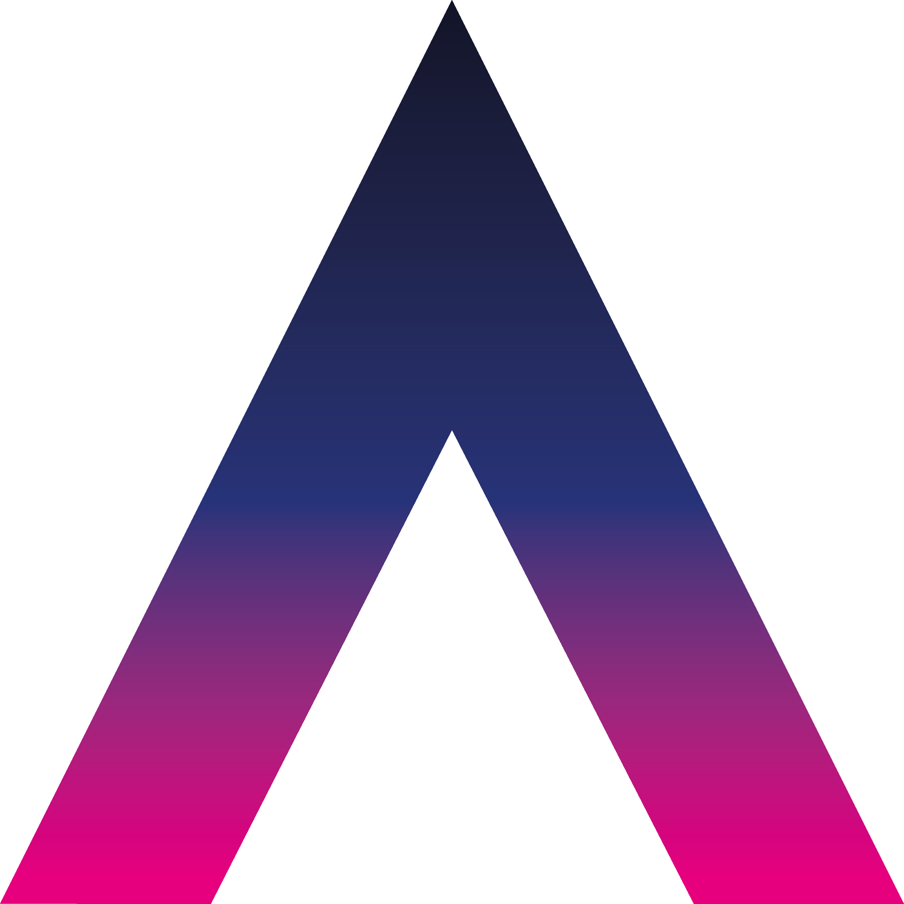 | Isotipo "A" emblemático oscuro de alta resolución (2048x2048). |
| `artefact_monogram_a_white.png` | 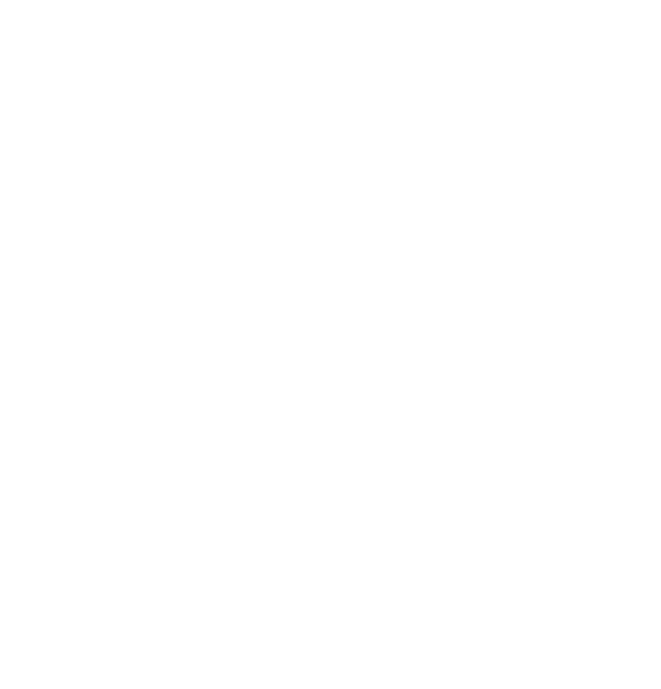 | Isotipo "A" emblemático blanco de alta resolución (1968x2048). |
| `artefact_logo_tagline_white.png` | 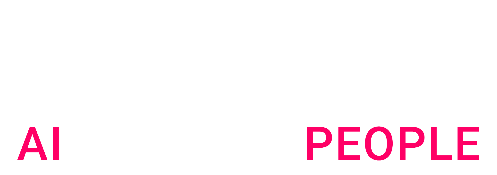 | Logotipo con tagline institucional "Data & AI Consulting". |
| `artefact_logo_stacked_gradient.png` | 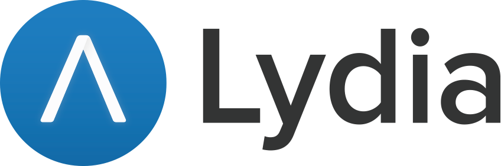 | Versión apilada con isotipo en degradado institucional. |

---

## 2. Iconos 3D Glassy de Áreas de Práctica (`assets/icons/glassy_3d/`)

Iconos hiperrealistas tridimensionales con efecto de cristal y luz, diseñados para ilustrar las verticales de negocio de Artefact.

| Archivo | Vista Previa | Concepto / Práctica de Artefact |
| :--- | :---: | :--- |
| `icon_glassy_data_foundations_bi.png` | 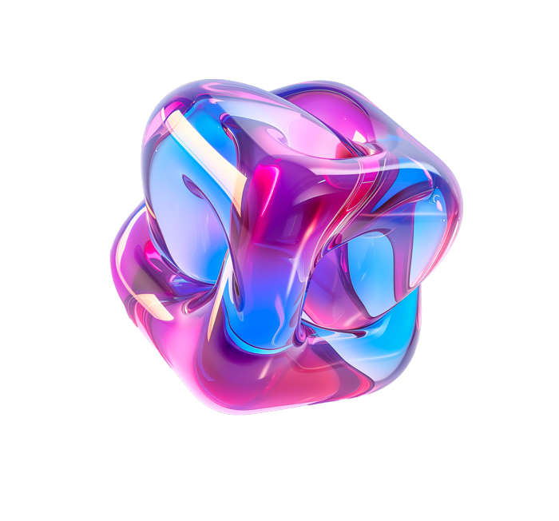 | **Data Foundations & BI** |
| `icon_glassy_ai_acceleration.png` | 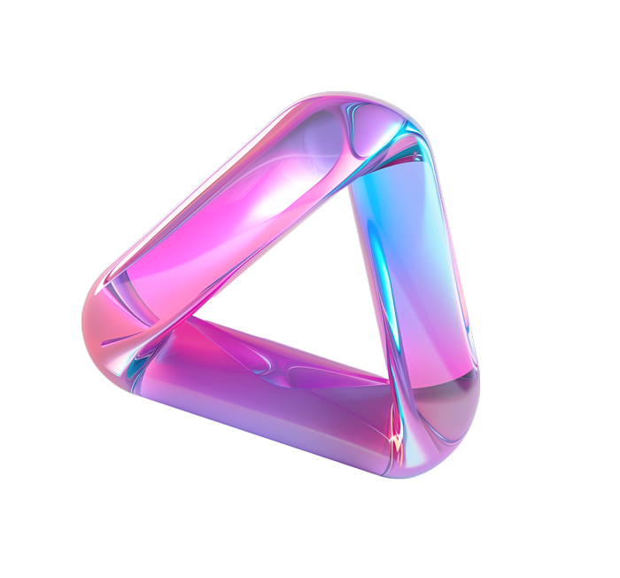 | **AI Acceleration** |
| `icon_glassy_it_data_platform.png` | 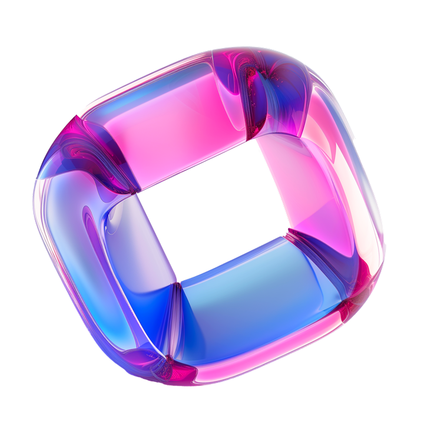 | **IT & Data Platform** |
| `icon_glassy_strategy_transformation.png` | 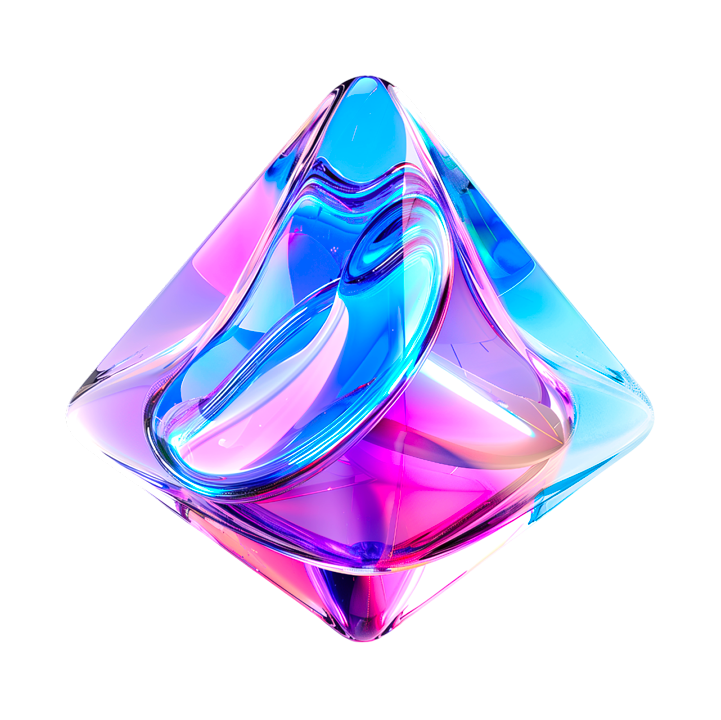 | **Strategy & Transformation** |
| `icon_glassy_cx_digital_marketing.png` | 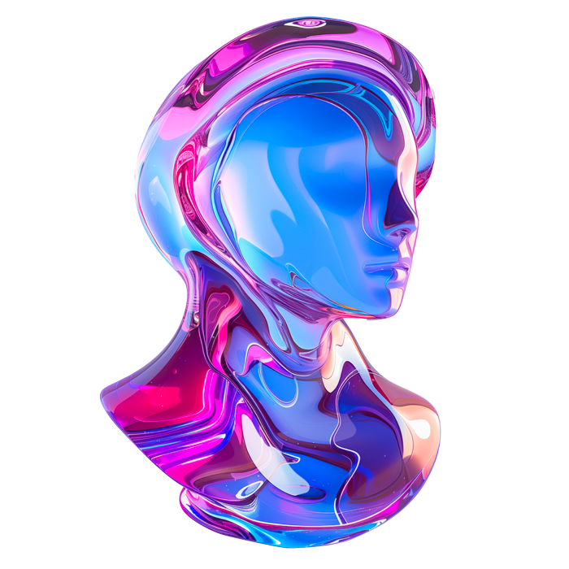 | **CX & Digital Marketing** |
| `icon_glassy_marketing_datadriven.png` | 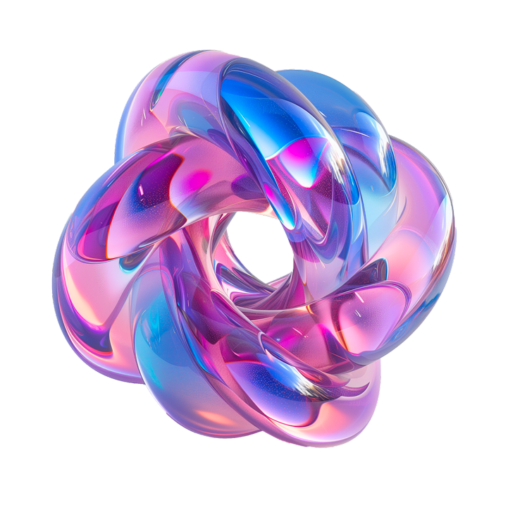 | **Marketing Data-Driven** |
| `icon_glassy_iconic_a.png` | 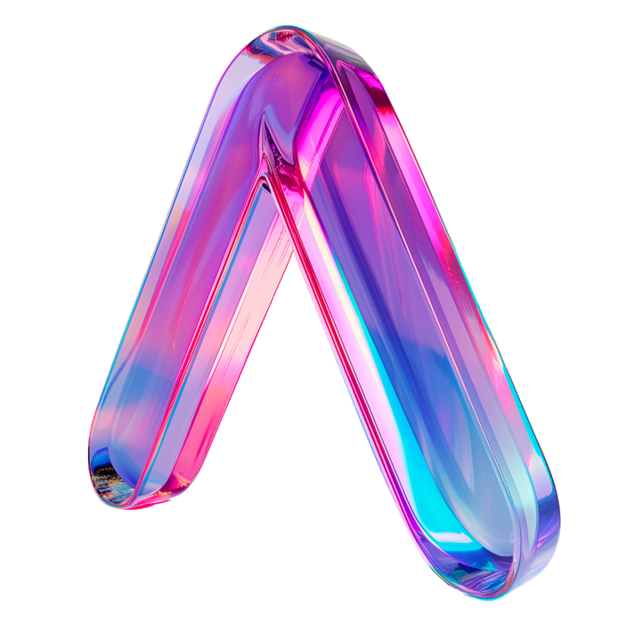 | **Iconic A of Artefact** (Símbolo de cristal insignia) |
| `icon_glassy_people.png` | 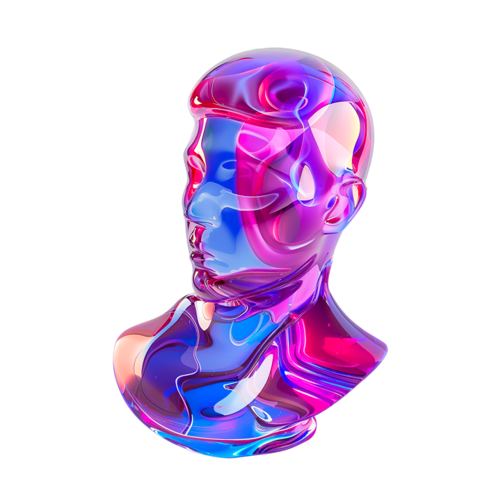 | **People & Culture / Talento** |
| `icon_glassy_clients.png` | 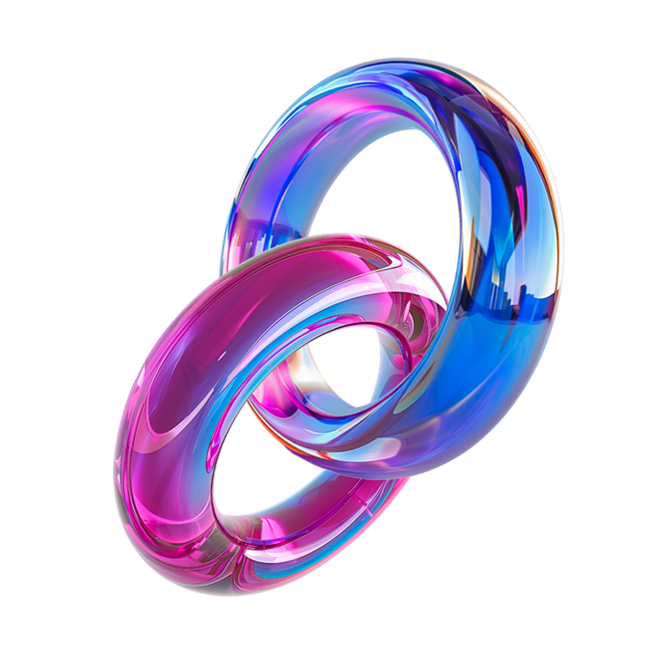 | **Clients & Partnerships / Ecosistema** |
| `icon_glassy_ai_hero_large.png` | 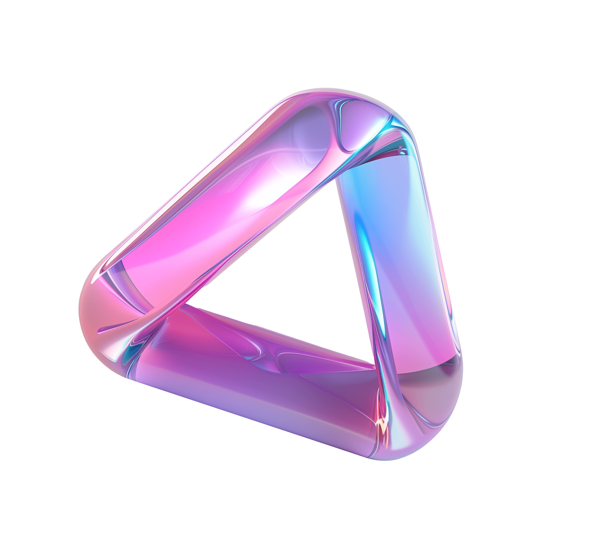 | **AI Acceleration Hero** (2048x1906 píxeles para portadas) |
| `icon_glassy_data_hero_large.png` | 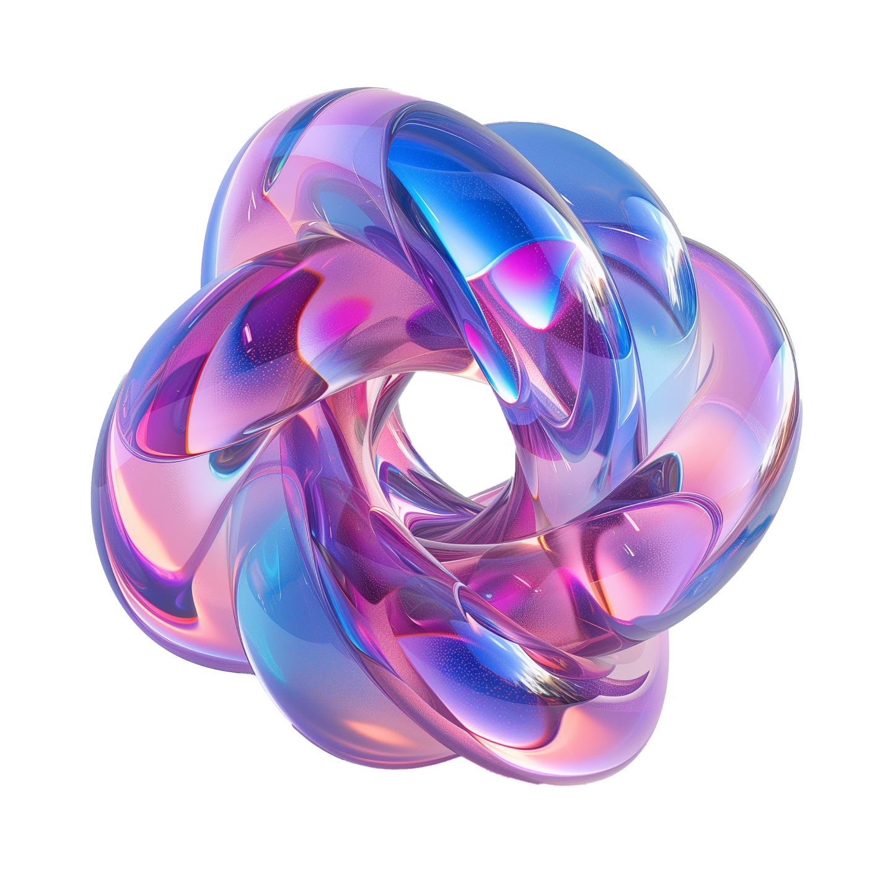 | **Data Hero** (1441x1440 píxeles para portadas) |
| `icon_glassy_marketing_hero_large.png` | 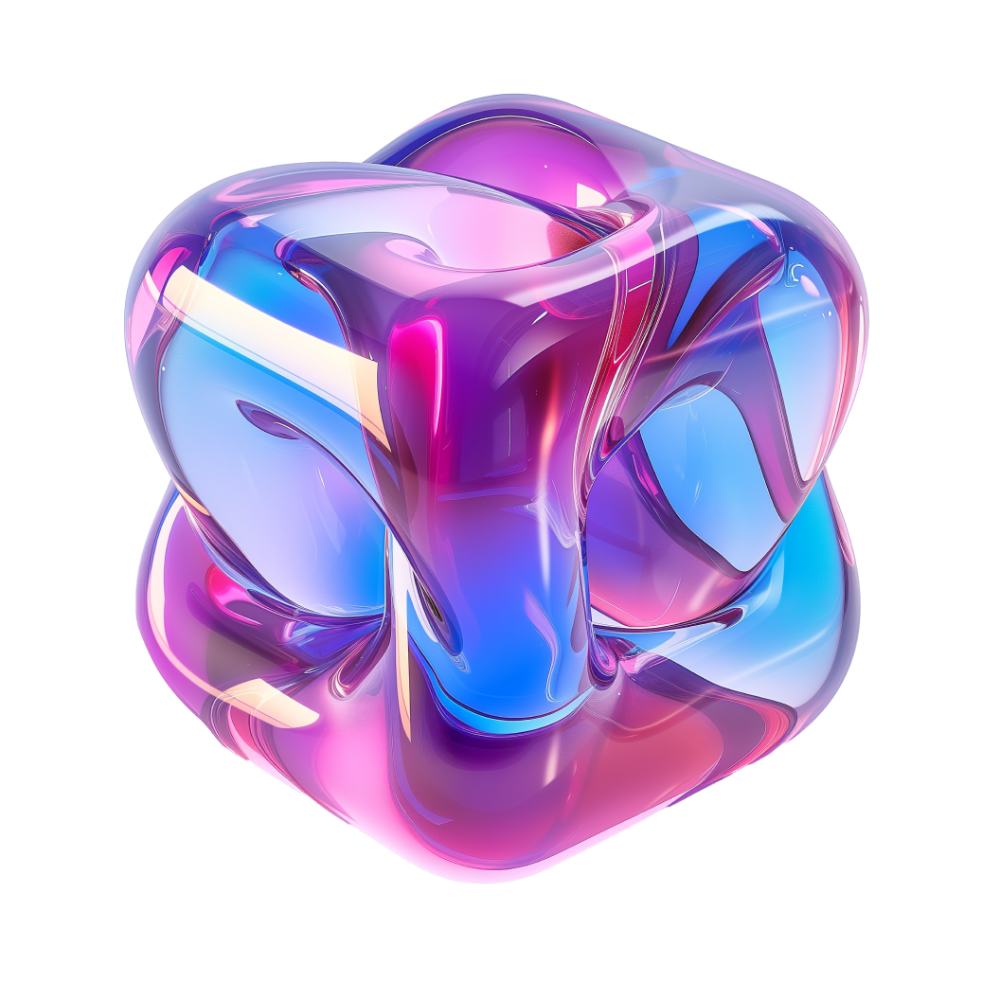 | **Marketing Hero** (1056x1056 píxeles para portadas) |

---

## 3. Iconos Planos de UI (`assets/icons/ui_flat/`)

39 iconos rasterizados extraídos de la Slide 94 (Non editable icons):

| Icono | Vista Previa | Icono | Vista Previa | Icono | Vista Previa |
| :--- | :---: | :--- | :---: | :--- | :---: |
| `icon_ui_01.png` |  | `icon_ui_02.png` |  | `icon_ui_03.png` |  |
| `icon_ui_04.png` |  | `icon_ui_05.png` |  | `icon_ui_06.png` |  |
| `icon_ui_07.png` |  | `icon_ui_08.png` |  | `icon_ui_09.png` |  |
| `icon_ui_10.png` |  | `icon_ui_11.png` | 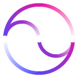 | `icon_ui_12.png` | 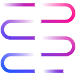 |
| `icon_ui_13.png` | 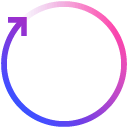 | `icon_ui_14.png` | 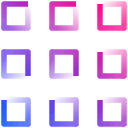 | `icon_ui_15.png` | 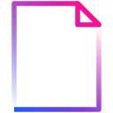 |
| `icon_ui_16.png` | 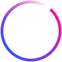 | `icon_ui_17.png` | 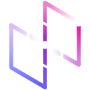 | `icon_ui_18.png` | 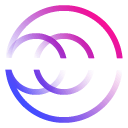 |
| `icon_ui_19.png` | 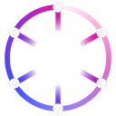 | `icon_ui_20.png` |  | `icon_ui_21.png` |  |
| `icon_ui_22.png` |  | `icon_ui_23.png` |  | `icon_ui_24.png` |  |
| `icon_ui_25.png` |  | `icon_ui_26.png` |  | `icon_ui_27.png` |  |
| `icon_ui_28.png` |  | `icon_ui_29.png` |  | `icon_ui_30.png` | 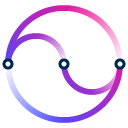 |
| `icon_ui_31.png` | 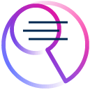 | `icon_ui_32.png` | 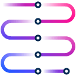 | `icon_ui_33.png` | 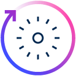 |
| `icon_ui_34.png` | 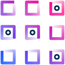 | `icon_ui_35.png` | 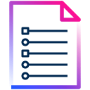 | `icon_ui_36.png` | 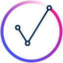 |
| `icon_ui_37.png` | 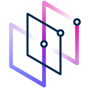 | `icon_ui_38.png` | 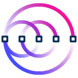 | `icon_ui_39.png` | 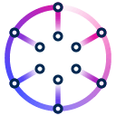 |

---

## 4. Símbolos Temáticos & Banners (`assets/icons/symbols/`)

16 banners y composiciones gráficas extraídas de la Slide 95 (Symbols templates).

---

## 5. Iconos Vectoriales Editables en SVG (`assets/icons/vector_svg/`)

Se han extraído **171 iconos vectoriales puros en formato SVG** a partir de las diapositivas 90, 91, 92 y 93.

- **Resolución Infinita**: Geometría vectorial pura (`<path d="...">`).
- **Compatibilidad**: Listos para importar en Figma, Illustrator, Web, PPTX o Google Slides.
- **Ubicación**: `calm-babbage/assets/icons/vector_svg/` (`vector_icon_s90_*.svg` a `vector_icon_s93_*.svg`).
